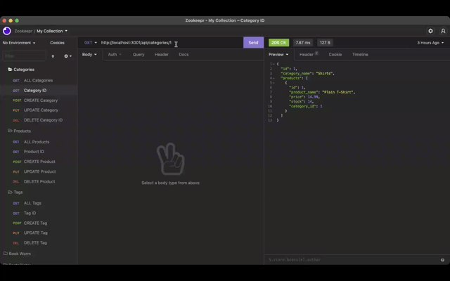

# E-Commerce ORM (Back End)

This is a back-end-only application that uses node, express, and sequelize to store various shopping categories, products, and tags.

## Installation

Download the source folder and type 'npm i' to install the dependencies. 

Once everything is installed, create a file called '.env' and place your sql credentials in order to use the mysql package and connect it to your server.

Once all the packages are installed, go to the root folder in the terminal and type: ```npm run seed.```

When all the information is seeded, type ```npm start``` and the server will initialize. 

Using Insomnia you can query and edit the database with different endpoints (please see videos for more information and a proper demo)

## Demos
(Click the links for web.mp file)

 [Get All](https://watch.screencastify.com/v/oefwnnIeNBPraCQh1nD1)
 


 [Get by ID](https://watch.screencastify.com/v/O2AKo4vSPl69RKy0ROW7)
 


 [Create/Edit/Delete Categories](https://watch.screencastify.com/v/XQZnvdyZM78uE171aKpA)
 


 [Create/Edit/Delete Products](https://watch.screencastify.com/v/qxQ5Hce0sZfYbcXgHolI)
 


 [Create/Edit/Delete Tags](https://watch.screencastify.com/v/SAPHUnPUe8TvE8hnQgsi)
 

